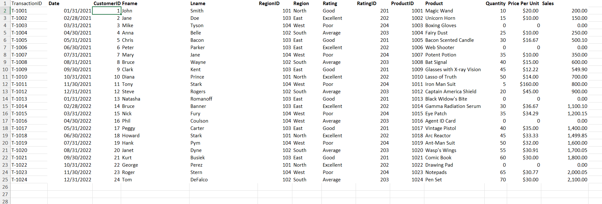

# Midterm Lab Task 1 - Data Cleaning and Preparation using Excel
In this activity, we cleaned an excel sheet fill of errors and redundancy using different excel features.
## Step 1
- Load the raw file
- Fit Collumn and row width and hiegth
- TRIM extra spaces
- Remove NULL values
- Remove Duplicates
## Step 2
- Performed 1NF
- Perform Table split using 2NF
- Perform 3NF
- Mapped the Normalized Tables as a Physical Data Model
## Step 3

## Step 4

## Here's the Physical Data Model
