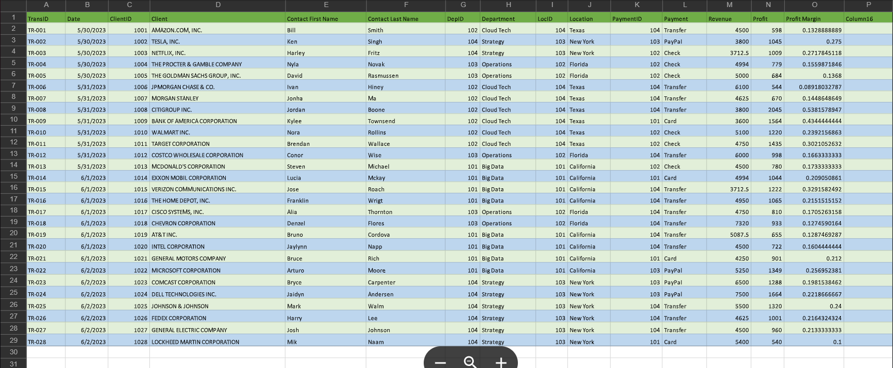
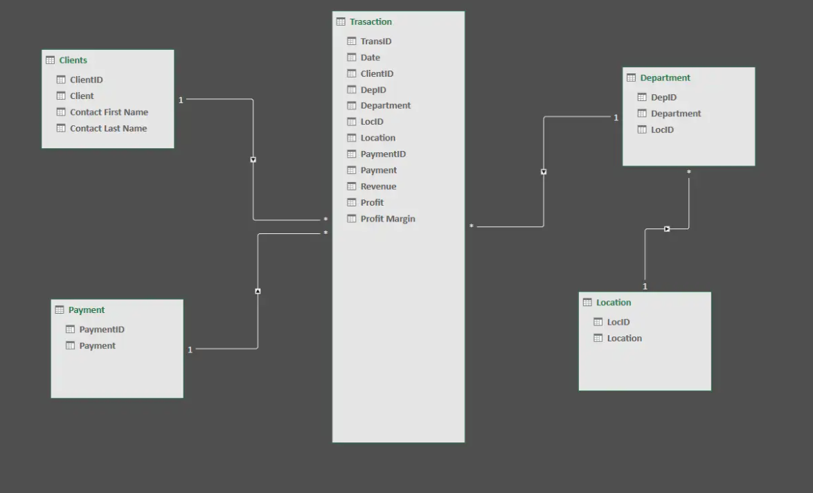

# Midterm Task 2 - Data Cleaning and Preparation using Power Query

## Step 1
- load the save data
- Open power query
- Edit data
- Create sperate data and sort table sheet properly
- Select column each table sheet
- Remove blank rows
## Step 2
- 
## Step 3

## Step 4

